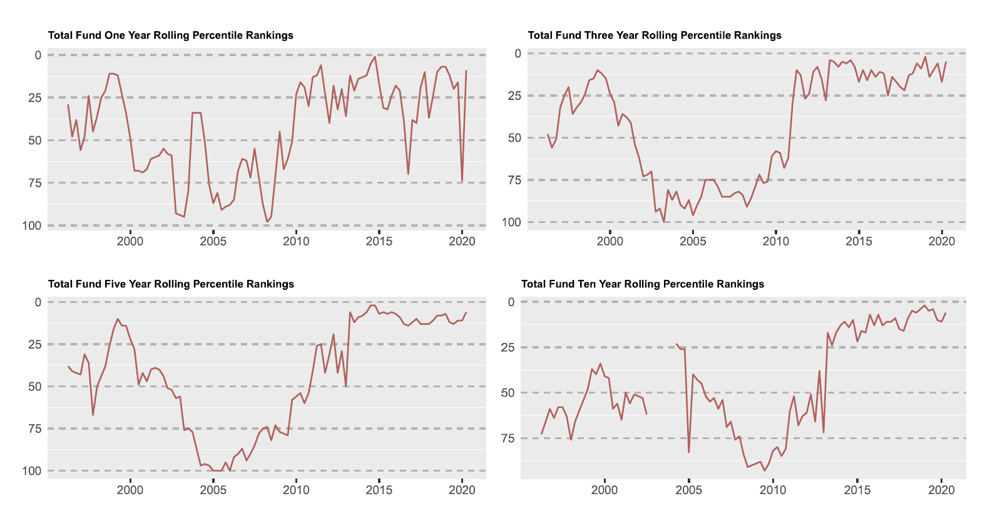

# Karl Polen
karl.polen@gmail.com    

## Summary

Karl Polen is the retired Chief Investment Officer of the Arizona Statement Retirement System, where he managed a $40 billion investment program.  Following a 30 year private sector career of diverse managerial responsibilities, he chose to spend the last ten years of his career in public service.

## Experience Highlights

*Investment experience with ASRS (as CIO and Head of Private Markets Investing)* - Joined ASRS in 2010 as Head of Private Markets Investing and was promoted to CIO in 2016.  As CIO lead a team in the implementation of all aspects of the investing program including asset allocation, risk management, reporting, manager selection and asset management.  Implemented a direct and separate account investing program in private debt and real estate encompassing over 30% of fund assets.  Implemented a program of direct investment in asset managers in the real estate and credit sectors.   

*Investment experience with ASRS (as trustee)* - Served as trustee of ASRS from 1994 through 2007 including two years as Chairman of the Board, three years as Chairman of Investments and was a member of the investment committee throughout the board tenure.  In these capacities, worked with trustees and ASRS senior team on asset allocation and investment policy.    

*Real Estate Acquisitions and Finance* - Fifteen years experience as chief financial officer of 1500 employee home construction and land development firm.  Arranged over $1 billion in debt and equity financing for real estate projects in all major categories.  Experience in loan administration, reporting and investor relations.  Experienced in tax free municipal finance in multiple states.  Lead deal teams and principal negotiator for real estate and operating company investments.

*Restructuring and Distressed Assets* - Experienced as both a debtor and creditor in restructuring matters. Lead company representative and witness in a $500 million bankruptcy resulting in a successful restructuring allowing the equity holder to retain ownership of asset with substantial mitigation of obligations to secured creditors.  Experienced investor in distressed assets including defaulted debt and foreclosure situations.

*Real estate project and operations management* -- Supervise teams of several hundred people involved in real estate projects and operating companies. Experience in all major real estate types including large scale community development, hotel, office, retail, industrial and apartments.  Experienced in all phases of operations including construction management, country club operations, utility operations, hotel asset management and all types of rental property management.  

*Entitlements and government relations*  -- Lead zoning efforts and negotiation of development agreements on multiple large scale real estate projects.  Lead efforts to obtain water and environmental permits for projects totaling 50,000 housing units. Successfully defended permit challenges in court settings. Active involvement in water policy formulation through participation on numerous governor-appointed commissions on water policy matters and as a member of the board of directors of the Central Arizona Project. Active in legislative matters, notably including leadership on successful effort to enact groundwater replenishment laws in Arizona.  

*Infrastructure Management* -- Supervised operation of six water and sewer companies serving 20,000 customers.  Experienced in investor owned utility regulatory matters including certificates of convenience and necessity, financing cases and rate setting. 

*Technical and Analytical* - Strong computer skills with early work experience as a computer programmer and controller managing a data processing and accounting department.  Current proficiency in R, Latex, Markdown and various packages for machine learning and artificial intelligence.   Wrote code in these platforms to implement analytical methods for performance evaluation and reporting systems now in use by ASRS.  Trained investment team members in coding enhancing their skills and productivity.

## Investment Track Record at ASRS
Following are investment results for the five years ended December 31, 2019.  

Asset Class	| Benchmark	| Portfolio|	Benchmark| Excess
------------|----------- | --------:| --------:| -----:|
Total Fund |	Blend	| 7.9%	| 6.3%	| 1.6%|
Public Equities | 	ACWI	| 8.4%	| 8.9%	| -.5%| 
Private Equities | Russell 2000	| 11.6%	| 8.7%	| 2.9%|    
Credit	| LSTA+250 |	8.0%	| 5.9%	| 2.1%|
Real Estate |	ODCE	 | 9.8%	| 7.7%	| 2.1%|   
Core Bonds	| Barclay's Agg	| 3.3%	| 3.1%	| .2%| 

During Karl Polen's tenure at ASRS, he was instrumental in implementing substantial revisions to the investment approach.  Previously, the ASRS relied on public equities as the primary driver of returns.  The program was re-envisioned to migrate nearly 50% of the assets to private equity, real estate and credit.  The real estate and credit programs were implemented in separate accounts and direct investments resulting in superior returns and substantially reduced fees.  When appropriate, ASRS also invested in substantial stakes in asset managers providing services to ASRS to capitalize on the value created by fee streams paid to those managers and the growth in those fees enabled partly through affiliation with ASRS.  

A shown in the following charts extracted from a public ASRS board presentation, the combined effect of these programs led to substantial improvements in ASRS investment results and led to ASRS consistently ranking in the top quartile when compared to other large U.S. public pension plans. 

### Employment History
Arizona State Retirement System, CIO and Head of Private Markets Investing (2010 to 2020)
Pivotal Group, Executive Vice President (2002-2010)     
Robson Communities, Chief Financial Officer (1987-2002)    
Earlier work experience as asset manager, controller and computer programmer    

### Education/Honors
Master of Business Administration, Vanderbilt University (graduated tied for 1st in class)    
Certified Public Accountant (passed test with highest score in state and among highest in nation, license currently inactive status)    
Bachelor of Music, University of Illinois    
Supplemental undergraduate studies at University of Tennessee completing over 100 semester hours in mathematics, computer science and accounting 

### Professional Affiliations
Member of the Q Group    
Full member of the Urban Land Institute    

### Community Involvement
Board of Directors of the Boys and Girls Clubs of Metropolitan Phoenix    
Founder of the Jemeille Ackourey Scholarship program providing music lessons to needy children    
Trustee of the Arizona State Retirement System     
Board of Directors of the Central Arizona Project    
Member of the Governor's Groundwater Management Advisory Commission     
Member of the Governor's Central Arizona Project Advisory Commission     
Member of the Governor's Assured Water Supply Economic Analysis Committee    

### Publications
*The Pragmatics of Private Markets Investing* in The Journal of Portfolio Management Fund Manager Selection 2020, 46 (5) 79-89; DOI: https://doi.org/10.3905/jpm.2020.1.135     
Leading voices podcast at [https://leadingvoicespodcast.com/karl-polen-chief-investment-officer/](https://leadingvoicespodcast.com/karl-polen-chief-investment-officer/)    
Other writings and sample code can be found at [https://karlpolen.github.io/](https://karlpolen.github.io/) 

